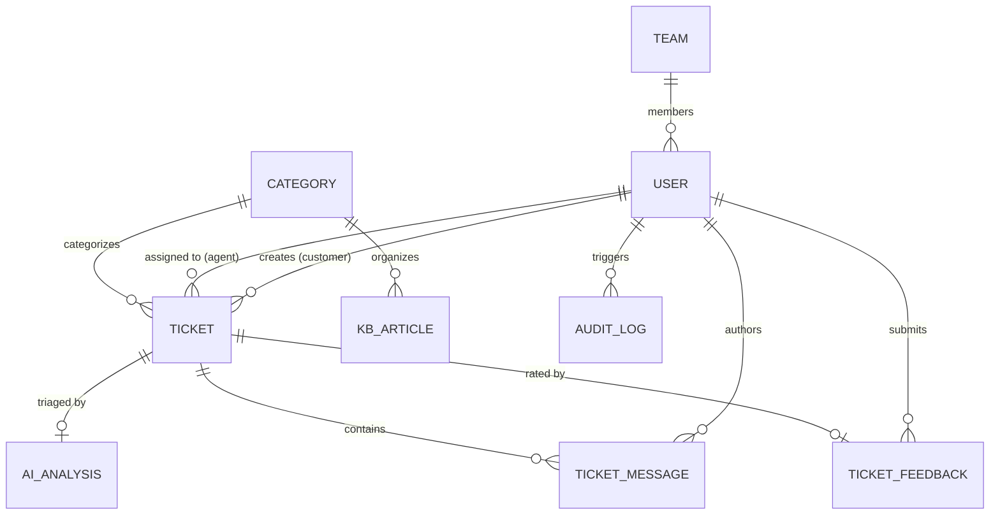

# Database Architecture & Data Dictionary

OmniSupport AI uses MongoDB with Mongoose 8. The database schema design guarantees referential consistency, atomic ticket sequence generation, rapid full-text search, and performant aggregation pipelines.

---

## 1. Entity Relationship Overview

---

## 2. Collections & Schema Definitions

### 2.1 `users`
Represents platform actors across all roles.
* Fields:
  - `_id`: ObjectId
  - `name`: String (trimmed, max 100)
  - `email`: String (lowercase, unique, indexed)
  - `passwordHash`: String (bcrypt salt rounds 10)
  - `role`: Enum (`CUSTOMER`, `AGENT`, `ADMIN`)
  - `isActive`: Boolean (default: `true`)
  - `teamIds`: Array of ObjectIds -> `teams`
  - `avatar`: String (URL)
  - `timestamps`: `createdAt`, `updatedAt`
* Indexes:
  - `{ email: 1 }` (Unique)
  - `{ role: 1, isActive: 1 }`

### 2.2 `counters`
Provides atomic, sequential, zero-collision ticket sequence numbers (`TKT-000001`).
* Fields:
  - `_id`: String (e.g. `'ticket_number'`)
  - `seq`: Number (incremented via `$inc`)

### 2.3 `categories`
Taxonomy for ticket triage and knowledge base articles.
* Fields:
  - `_id`: ObjectId
  - `name`: String (unique)
  - `description`: String
  - `isActive`: Boolean

### 2.4 `teams`
Specialized support teams (Billing, Technical Tier 2, etc.).
* Fields:
  - `_id`: ObjectId
  - `name`: String (unique)
  - `description`: String
  - `leadId`: ObjectId -> `users`
  - `memberIds`: Array of ObjectIds -> `users`
  - `isActive`: Boolean

### 2.5 `tickets`
The core transactional entity representing support inquiries.
* Fields:
  - `_id`: ObjectId
  - `ticketNumber`: String (unique, immutable, e.g. `TKT-000001`)
  - `customerId`: ObjectId -> `users` (indexed)
  - `subject`: String (trimmed, max 200)
  - `description`: String (max 5000)
  - `categoryId`: ObjectId -> `categories`
  - `priority`: Enum (`LOW`, `MEDIUM`, `HIGH`, `URGENT`)
  - `prioritySource`: Enum (`HUMAN`, `AI`, `SYSTEM`)
  - `status`: Enum (`OPEN`, `ASSIGNED`, `IN_PROGRESS`, `WAITING_FOR_CUSTOMER`, `RESOLVED`, `CLOSED`, `REOPENED`)
  - `assignedAgentId`: ObjectId -> `users` (indexed, nullable)
  - `teamId`: ObjectId -> `teams` (nullable)
  - `aiAnalysisId`: ObjectId -> `ai_analyses` (nullable)
  - `attachments`: Array of Attachment subdocuments
  - `resolvedAt`: Date
  - `closedAt`: Date
  - `reopenedAt`: Date
  - `lastCustomerMessageAt`: Date
  - `lastAgentMessageAt`: Date
* Indexes:
  - `{ ticketNumber: 1 }` (Unique)
  - `{ customerId: 1, status: 1 }` (Compound)
  - `{ assignedAgentId: 1, status: 1 }` (Compound)
  - `{ status: 1, priority: 1 }` (Compound)
  - `{ subject: 'text', description: 'text' }` (Full-Text Search)

### 2.6 `ticket_messages`
The immutable timeline of communications on a ticket.
* Fields:
  - `_id`: ObjectId
  - `ticketId`: ObjectId -> `tickets` (indexed)
  - `authorId`: ObjectId -> `users`
  - `authorRole`: Enum (`CUSTOMER`, `AGENT`, `ADMIN`, `SYSTEM`)
  - `type`: Enum (`CUSTOMER_MESSAGE`, `AGENT_MESSAGE`, `INTERNAL_NOTE`, `SYSTEM_EVENT`)
  - `message`: String
  - `attachments`: Array of Attachment subdocuments
  - `timestamps`: `createdAt`
* Indexes:
  - `{ ticketId: 1, createdAt: 1 }`
  - `{ ticketId: 1, type: 1 }` (Critical for database-level note filtering)

### 2.7 `knowledge_base_articles`
Knowledge base documentation articles used for self-service and RAG retrieval.
* Fields:
  - `_id`: ObjectId
  - `title`: String
  - `content`: String
  - `categoryId`: ObjectId -> `categories`
  - `tags`: Array of Strings
  - `status`: Enum (`DRAFT`, `PUBLISHED`, `ARCHIVED`)
  - `createdBy`: ObjectId -> `users`
* Indexes:
  - `{ title: 'text', content: 'text', tags: 'text' }` (Full-Text Search Index)
  - `{ status: 1, categoryId: 1 }`

### 2.8 `ticket_feedbacks`
Customer Satisfaction (CSAT) rating and reviews.
* Fields:
  - `_id`: ObjectId
  - `ticketId`: ObjectId -> `tickets` (unique index prevents duplicate ratings)
  - `customerId`: ObjectId -> `users`
  - `rating`: Number (1 to 5)
  - `feedback`: String (optional)

### 2.9 `audit_logs`
Immutable compliance and action ledger.
* Fields:
  - `_id`: ObjectId
  - `action`: String (e.g. `TICKET_STATUS_CHANGED`, `TICKET_ASSIGNED`)
  - `entityType`: String (`TICKET`, `USER`, `CATEGORY`)
  - `entityId`: ObjectId
  - `performedBy`: ObjectId -> `users`
  - `details`: Object (stores old/new status, assignment metadata)
  - `timestamps`: `createdAt`

### 2.10 `ai_analyses` & `ai_usage_logs`
Structured AI inference outputs and operational performance telemetry.
* Fields:
  - `ticketId`: ObjectId -> `tickets`
  - `category`: String
  - `priority`: Enum (`LOW`, `MEDIUM`, `HIGH`, `URGENT`)
  - `sentiment`: Enum (`POSITIVE`, `NEUTRAL`, `NEGATIVE`)
  - `confidence`: Number (0.0 to 1.0)
  - `reason`: String
  - `latencyMs`: Number
  - `tokensUsed`: Number
  - `usedFallback`: Boolean
