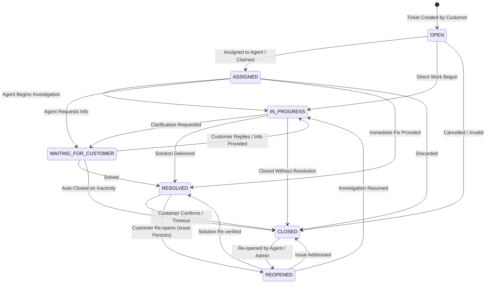

# Ticket State Machine Architecture

The lifecycle of support tickets in OmniSupport AI is governed by a **deterministic finite state machine (FSM)** implemented in `server/src/services/ticketStateMachine.service.ts`.

---

## 1. State Transition Diagram

---

## 2. Valid Transitions Table

| Current State | Allowed Next States | Illegal Transitions (Returns 409) |
| :--- | :--- | :--- |
| `OPEN` | `ASSIGNED`, `IN_PROGRESS`, `CLOSED` | `RESOLVED`, `WAITING_FOR_CUSTOMER`, `REOPENED` |
| `ASSIGNED` | `IN_PROGRESS`, `WAITING_FOR_CUSTOMER`, `RESOLVED`, `CLOSED` | `OPEN`, `REOPENED` |
| `IN_PROGRESS` | `WAITING_FOR_CUSTOMER`, `RESOLVED`, `CLOSED` | `OPEN`, `ASSIGNED`, `REOPENED` |
| `WAITING_FOR_CUSTOMER` | `IN_PROGRESS`, `RESOLVED`, `CLOSED` | `OPEN`, `ASSIGNED`, `REOPENED` |
| `RESOLVED` | `CLOSED`, `REOPENED` | `OPEN`, `ASSIGNED`, `IN_PROGRESS`, `WAITING_FOR_CUSTOMER` |
| `REOPENED` | `IN_PROGRESS`, `RESOLVED`, `CLOSED` | `OPEN`, `ASSIGNED`, `WAITING_FOR_CUSTOMER` |
| `CLOSED` | `REOPENED` | `OPEN`, `ASSIGNED`, `IN_PROGRESS`, `RESOLVED` |

---

## 3. Automated Business Triggers

1. **Ticket Assignment Auto-Transition**:
   When an agent claims or is assigned an `OPEN` ticket, `ticket.service.assignTicket` automatically updates the status to `ASSIGNED`.
2. **Customer Reply Auto-Transition**:
   When a ticket is in `WAITING_FOR_CUSTOMER` and the customer posts a message (`CUSTOMER_MESSAGE`), `message.service.addMessage` automatically transitions the status to `IN_PROGRESS`.
3. **Audit Trail Logging**:
   Every state transition records an entry in `audit_logs` storing `{ oldStatus, newStatus, actorId, timestamp }`.
4. **Resolution Timestamping**:
   Transitioning to `RESOLVED` sets `ticket.resolvedAt = new Date()`. Transitioning to `CLOSED` sets `ticket.closedAt = new Date()`.
